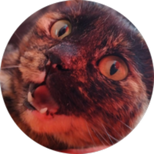
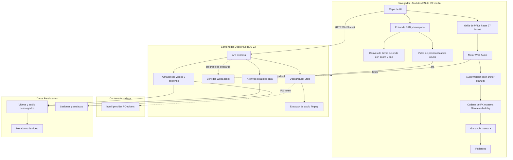

<div align="center">



# PumaSamplerMusic

**Convierte videos de YouTube en un sampler de teclado.** Descarga un video, elige cualquier fragmento de tiempo y asígnalo a una tecla. Presiona la tecla — escucha el audio y mira el video reproducirse.

📖 [Read in English](README_EN.md)

[![Docker][docker-badge]][docker-link]
[![Node.js][node-badge]][node-link]
[![License][license-badge]](LICENSE)
[![PumaSoft][pumasoft-badge]][pumasoft-link]

[Descargar / Ejecutar](#inicio-rápido) · [Cómo funciona](#cómo-funciona) · [Características](#características) · [Arquitectura](#arquitectura) · [Desarrollo](#desarrollo)

</div>

---

## Problema

Crear samplers a partir de videos en línea suele ser un flujo de trabajo con varias herramientas: descargar con una aplicación, cortar con otra, cargarlo en un DAW, mapearlo a MIDI. La necesidad es simple: tomar rápidamente el bombo de un video de batería, un fragmento vocal de un show en vivo, o un golpe de bajo de un tutorial, y reproducirlo desde el teclado.

PumaSamplerMusic resuelve esto en una sola ventana del navegador: pega una URL de YouTube, marca un fragmento, asigna una tecla, reproduce.

## Solución

- **Descarga completa de video** — `yt-dlp` descarga el video completo; `ffmpeg` extrae la pista de audio.
- **Hasta 27 PADs asignables** — cada PAD puede vincularse a cualquier tecla del teclado (o combinación como `shift+a`).
- **Editor de fragmentos de tiempo** — visualización de forma de onda con controladores de arrastre, más controles de transporte (reproducir, marcar entrada, marcar salida) para fijar el segmento exacto mientras el video se reproduce.
- **Persistencia de sesiones** — guarda/carga la disposición de PADs como un archivo JSON, o inicia una sesión nueva a partir de una plantilla copiada de una sesión existente. El gestor de sesiones ofrece búsqueda y eliminación por sesión.
- **Modo Organizar** — reorganiza la grilla sin disparar audio: arrastra para intercambiar o mover PADs, copia un PAD a otro, o límpialo con un modal de confirmación; también hay un menú contextual (clic derecho / mantener presionado).
- **Barra superior compacta** — las acciones secundarias (Nueva, Gestionar, Exportar, Importar, Logs, Configuración) viven en un menú de tres puntos (⋯); cada una de las cinco acciones puede anclarse (pin) a la barra como botón. El botón STOP muestra solo el ícono y la tecla configurada.
- **Configuración** — un modal con la tecla de stop configurable y el tamaño de texto de la aplicación; ambas preferencias se recuerdan entre sesiones.
- **PADs configurables** — de 9 a 27 PADs con color, volumen, tecla, modo de disparo y loop por PAD; se disparan con teclado, mouse o toque.
- **Cadena de FX maestra** — volumen maestro, filtro pasabajos (cutoff/resonancia), reverb y delay (tiempo/feedback) aplicados a todo lo que suena.
- **FX por PAD** — Tune (±12 semitonos), Cut, Res, envío a Rev y a Dly por PAD, más los switches P.SHIFT (afinar sin cambiar velocidad) y STRETCH con knob de Speed (50–200%, cambia la velocidad conservando el tono); ajustar los controles mientras el PAD suena lo deforma (warp) en tiempo real.
- **Knobs rotativos** — todos los controles de FX maestros y por PAD son knobs giratorios (arrastre vertical, rueda del mouse, Shift para ajuste fino), navegables por teclado.
- **Espacio de trabajo colapsable** — los paneles PADS, VIDEOS, editor de PAD y las tiras de FX general y por PAD se colapsan y son redimensionables por arrastre.
- **Resiliencia ante el bot-check de YouTube** — un contenedor auxiliar genera PO tokens para que `yt-dlp` pase la verificación "Sign in to confirm you're not a bot" sin necesidad de cookies; si aun así aparece, se puede pegar un cookies.txt exportado del navegador.
- **Corre en Docker** — un solo contenedor, un puerto, sin necesidad de Node.js o Python local.

## Inicio rápido

### Requisitos previos

- [Docker](https://docs.docker.com/get-docker/) y Docker Compose v2
- O, para desarrollo sin contenedores: Node.js 22+, Python 3, yt-dlp, ffmpeg

### Opción 1: manage.sh (recomendado)

```bash
git clone https://github.com/felipesuarez-dev/PumaSamplerMusic.git
cd PumaSamplerMusic
./manage.sh start
```

### Opción 2: Docker Compose

```bash
git clone https://github.com/felipesuarez-dev/PumaSamplerMusic.git
cd PumaSamplerMusic
docker compose up -d --build
```

Abre http://localhost:4070

### Acceso remoto (Tailscale)

Si el servidor está en tu tailnet, abre `http://<nombre-del-servidor>:4070` desde cualquier dispositivo. Con MagicDNS deshabilitado, usa la IP de Tailscale del servidor, por ejemplo:

```
http://100.105.21.49:4070
```

No se necesita redirección de puertos — Tailscale gestiona el túnel cifrado.

### Atajos de teclado

| Tecla | Acción |
|---|---|
| `I` | Fija el punto de **entrada** en la posición actual de la previsualización |
| `O` | Fija el punto de **salida** en la posición actual de la previsualización |
| `Espacio` | Reproducir/pausar previsualización |
| `Ctrl` + rueda del mouse | Hace zoom in/out en la forma de onda en la posición del cursor |
| `Escape` (configurable) | Detiene todos los PADs y pausa el video |
| `Ctrl/Cmd + Shift + H` | Mostrar/ocultar barra superior |

## Cómo funciona

1. **Agregar un video** — pega una URL de YouTube en la pestaña **Video Library** y haz clic en **Add Video**.
2. **Esperar la descarga** — el backend descarga el video completo y extrae el audio.
3. **Editar un PAD** — haz clic en uno de los PADs. Elige el video, asigna una tecla y fija el segmento de tiempo. Ajusta los knobs de FX por PAD (Tune, Cut, Res, Rev, Dly, y los switches P.SHIFT/STRETCH con su knob de Speed) para dar forma al sonido de ese PAD. Cada cambio (inicio/fin, color, volumen, tecla, video, modo de disparo, loop, FX) se guarda automáticamente en el PAD a medida que se hace — no hay un botón de guardado por PAD.
4. **Usar el transporte** — haz clic en **Play Preview** para ver el video, luego en **Set In** y **Set Out** para marcar el fragmento. O arrastra los controladores de la forma de onda directamente. Usa `Ctrl` + rueda del mouse para hacer zoom en la forma de onda y arrastra para desplazarte (pan), útil para hacer cortes precisos en muestras largas.
5. **Reproducir** — presiona la tecla asignada. El audio se reproduce a través del motor Web Audio (pasando por la cadena de FX maestra — filtro, reverb, delay) y el video aparece en el visualizador.
6. **Guardar la sesión** — el botón **Save** abre un modal para nombrarla; cárgala después desde el combo o desde el modal **Gestionar** (con búsqueda y eliminación por sesión). Al iniciar una sesión nueva se abre un modal de plantilla: empezar desde una disposición en blanco, o copiar los PADs de una sesión existente como punto de partida.
7. **Organizar la grilla** — activa **Organizar** (junto al selector de PADS) para arrastrar e intercambiar/mover PADs, copiar uno a otro o limpiarlo; mientras está activo los PADs no disparan audio.

## Características

| Área | Qué hace |
|---|---|
| **Video Library** | Agregar URLs de YouTube, ver progreso de descarga, eliminar videos en caché, ver título + duración |
| **Grilla de PADs** | Clic, mouse o toque para disparar y editar; presionar la tecla asignada también dispara; LED de actividad cuando un PAD está sonando |
| **Modo Organizar** | Botón junto al selector de PADS: arrastra para intercambiar o mover, menú contextual (clic derecho / mantener presionado), copiar a otro PAD, limpiar con confirmación; no dispara audio mientras está activo |
| **Editor de PAD** | Etiqueta, tecla, volumen, color, modo de disparo (one-shot / gate), loop, editor de segmento de forma de onda; cada edición se guarda automáticamente, sin botón de guardado por PAD |
| **FX por PAD** | Knobs de Tune (±12 semitonos), Cut, Res, envío a Rev y a Dly por PAD; switches P.SHIFT (afinar sin cambiar velocidad) y STRETCH con knob de Speed (50–200%, time-stretch); ajustar en vivo mientras el PAD hace loop lo deforma en tiempo real |
| **Knobs rotativos** | Controles de FX maestros y por PAD como knobs giratorios: arrastre vertical, rueda del mouse, Shift para ajuste fino, navegables por teclado |
| **Zoom/Pan de forma de onda** | `Ctrl` + rueda del mouse para zoom, arrastrar para pan, más botones de zoom in/out/reset para cortes precisos en muestras largas |
| **Transporte** | Reproducir previsualización, marcar entrada, marcar salida, detener; playhead sincronizado con la posición del video; íconos Material Symbols en vez de glifos Unicode planos |
| **Gestor de sesiones** | Guardar (modal con nombre)/cargar/eliminar sesiones; modal Gestionar con búsqueda y eliminación por fila; modal de sesión nueva para empezar de cero o copiar PADs de una sesión existente como plantilla |
| **Barra compacta / menú ⋯** | Acciones secundarias en un menú de tres puntos; cada una puede anclarse (pin) a la barra como botón (se recuerda); STOP muestra solo ícono + tecla |
| **Configuración** | Modal con tecla de stop configurable y tamaño de texto de la app; ambas preferencias persistentes |
| **FX maestros** | Volumen maestro, filtro (cutoff/resonancia), reverb y delay (tiempo/feedback) aplicados a todo lo que suena |
| **Espacio de trabajo colapsable** | Paneles PADS, VIDEOS, editor de PAD y tiras de FX general/por PAD se colapsan desde su cabecera/pestaña y son redimensionables por arrastre |
| **Detención global** | El botón STOP o la tecla **Escape** silencia todos los PADs y pausa el video |
| **Resiliencia YouTube** | Contenedor `bgutil-provider` genera PO tokens para sortear el bot-check de YouTube; panel de cookies en Video Library como respaldo |
| **Docker** | Un solo comando para compilar, ejecutar, respaldar y actualizar |

## Arquitectura



Regla: el frontend solo descarga buffers de audio por HTTP; el backend maneja todo el tráfico de YouTube, la descarga de video y la extracción de audio. Las sesiones son archivos JSON simples.

## Stack tecnológico

| Frontend | Backend | DevOps |
|---|---|---|
| Módulos ES de JS vanilla | Node.js 22 | Docker + docker-compose |
| Web Audio API (cadena de filtro, reverb, delay) + AudioWorklet (pitch-shifter granular) | Express | Wrapper `manage.sh` |
| `<video>` de HTML5 | Librería `ws` | HEALTHCHECK |
| Forma de onda en canvas con zoom/pan | yt-dlp | bind-mount de `./data` |
| CSS Grid + propiedades personalizadas | ffmpeg | usuario node (uid 1000) |
| Material Symbols (Google Fonts) | | bgutil-ytdlp-pot-provider (sidecar) |

## Desarrollo

```bash
# Iniciar el contenedor en segundo plano
./manage.sh start

# Ver logs
./manage.sh logs

# Detener
./manage.sh stop

# Reconstruir la imagen
./manage.sh update

# Respaldar datos + configuración
./manage.sh backup
```

## Configuración

Edita `docker-compose.yml`:

| Variable | Por defecto | Significado |
|---|---|---|
| `MAX_CACHE_GB` | 10 | Espacio máximo en disco para videos en caché |
| `MAX_CONCURRENT_DOWNLOADS` | 2 | Descargas en paralelo |
| `TZ` | America/Santiago | Zona horaria |
| `PORT` | 4070 | Puerto interno + externo |
| `COOKIES_FILE` | `/data/cookies.txt` | Ruta del archivo de cookies para yt-dlp |
| `POT_PROVIDER_URL` | `http://bgutil-provider:4416` | URL del proveedor de PO tokens |

## Estructura de datos

```
./data/videos/   — videos descargados (.mp4), audio extraído (.opus) y archivos JSON de metadatos de video
./data/sessions/ — archivos JSON de sesiones guardadas
```

## Notas

- Solo se aceptan URLs de YouTube (`youtube.com/watch?v=...` y `youtu.be/...`).
- La primera reproducción de un video puede tener una breve carga mientras el navegador decodifica el buffer de audio.
- El modo one-shot reproduce el segmento completo al presionar la tecla; el modo gate reproduce mientras la tecla se mantiene presionada.
- El caché de video usa disco, no RAM, porque los videos 1080p completos exceden los límites prácticos de tmpfs.
- Si YouTube muestra el error de bot-check a pesar del proveedor de PO tokens, pega un cookies.txt exportado del navegador en el panel de cookies de YouTube en Video Library.

## Autor

<div align="center">


**[PumaSoft][pumasoft-link]**

</div>

## Licencia

MIT © 2026 PumaSoft — ver [LICENSE](LICENSE).

[docker-badge]: https://img.shields.io/badge/Docker-2496ED?style=flat-square&logo=docker&logoColor=white
[docker-link]: https://www.docker.com
[node-badge]: https://img.shields.io/badge/Node.js-22-339933?style=flat-square&logo=node.js&logoColor=white
[node-link]: https://nodejs.org
[license-badge]: https://img.shields.io/badge/license-MIT-a8d8a8?style=flat-square
[pumasoft-badge]: https://img.shields.io/badge/by-PumaSoft-ff9f1c?style=flat-square
[pumasoft-link]: https://github.com/felipesuarez-dev
