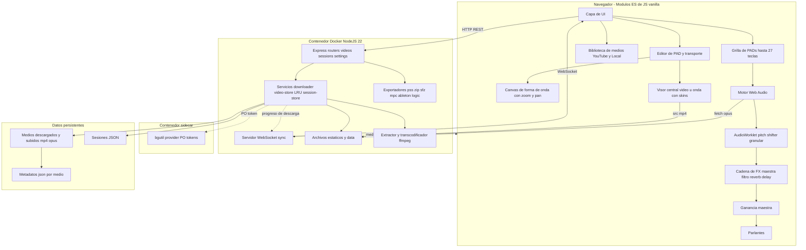

<div align="center">


# PumaSamplerMusic

**Convierte videos de YouTube o archivos locales en un sampler de teclado.** Descarga un video (o sube tu propio audio/video), elige cualquier fragmento de tiempo y asígnalo a una tecla. Presiona la tecla — escucha el audio y mira el video reproducirse.

📖 [Read in English](README_EN.md)

[![Docker][docker-badge]][docker-link]
[![Node.js][node-badge]][node-link]
[![License][license-badge]](LICENSE)
[![PumaSoft][pumasoft-badge]][pumasoft-link]

[Descargar / Ejecutar](#descargar--ejecutar) · [Cómo funciona](#cómo-funciona) · [Características](#características) · [Arquitectura](#arquitectura) · [Desarrollo](#desarrollo)


</div>

---

## Problema

Crear samplers a partir de videos en línea suele ser un flujo de trabajo con varias herramientas: descargar con una aplicación, cortar con otra, cargarlo en un DAW, mapearlo a MIDI. La necesidad es simple: tomar rápidamente el bombo de un video de batería, un fragmento vocal de un show en vivo, o un golpe de bajo de un tutorial, y reproducirlo desde el teclado.

PumaSamplerMusic resuelve esto en una sola ventana del navegador: pega una URL de YouTube (o sube un archivo local), marca un fragmento, asigna una tecla, reproduce.

## Solución

- **Descarga completa de video** — `yt-dlp` descarga el video completo; `ffmpeg` extrae la pista de audio.
- **Medios locales** — además de YouTube, puedes subir tus propios archivos de audio o video desde la pestaña **Local** de la Biblioteca de medios; se procesan con `ffmpeg` igual que los descargados.
- **Hasta 27 PADs asignables** — cada PAD puede vincularse a cualquier tecla del teclado (o combinación como `shift+a`).
- **Editor de fragmentos de tiempo** — visualización de forma de onda con controladores de arrastre, más controles de transporte (reproducir, marcar entrada, marcar salida) para fijar el segmento exacto mientras el medio se reproduce.
- **Auto-Slicer** — analiza el audio de un medio (detección de onsets por flujo espectral, o una cuadrícula por beats) y genera cortes automáticamente; revisa los slices sobre la forma de onda, previsualiza cada uno y asígnalos a PADs libres o crea una sesión nueva con la selección.
- **Chops manuales** — corta la pista a mano colocando cada marca sobre la forma de onda, con las mismas opciones de previsualización y asignación.
- **Persistencia de sesiones** — guarda o carga la disposición de PADs como un archivo JSON, o inicia una sesión nueva a partir de una plantilla copiada de una sesión existente. El gestor de sesiones ofrece búsqueda y eliminación por sesión.
- **Exportación a DAW** — exporta la sesión como paquete `.zip` (audio `.opus` + `.wav` + manifiesto), como `.pss` reimportable, o a formatos de instrumento: **SFZ, DecentSampler, MPC (.xpm), FL Slicer, Ableton y Logic**.
- **Modo Organizar** — reorganiza la grilla sin disparar audio: arrastra para intercambiar o mover PADs, copia un PAD a otro, o límpialo con un modal de confirmación; también hay un menú contextual (clic derecho o mantener presionado).
- **Barra superior compacta** — las acciones secundarias (Nueva, Gestionar, Exportar, Importar, Logs, Configuración) viven en un menú de tres puntos (⋯); cada una de las cinco acciones puede anclarse (pin) a la barra como botón. El botón STOP muestra solo el ícono y la tecla configurada.
- **Espacio de trabajo flexible** — los paneles MEDIOS y PADS pueden intercambiar de lado, y un control único contrae o expande todos los menús a la vez.
- **Configuración** — un modal con la tecla de stop configurable, las teclas del cortador y el tamaño de texto de la aplicación; las preferencias se recuerdan entre sesiones.
- **PADs configurables** — de 9 a 27 PADs con color, volumen, tecla, modo de disparo y loop por PAD; se disparan con teclado, mouse o toque.
- **Cadena de FX maestra** — volumen maestro, filtro pasabajos (cutoff/resonancia), reverb y delay (tiempo/feedback) aplicados a todo lo que suena.
- **FX por PAD** — Tune (±12 semitonos), Cut, Res, envío a Rev y a Dly por PAD, más los switches P.SHIFT (afinar sin cambiar velocidad) y STRETCH con knob de Speed (50–200%, cambia la velocidad conservando el tono); ajustar los controles mientras el PAD suena lo deforma (warp) en tiempo real.
- **Skins del visualizador** — el display central alterna entre video, forma de onda, barras de espectro, burbujas y un tornamesa de vinilo animado que gira con el audio.
- **Knobs rotativos** — todos los controles de FX maestros y por PAD son knobs giratorios (arrastre vertical, rueda del mouse, Shift para ajuste fino), navegables por teclado.
- **Resiliencia ante el bot-check de YouTube** — un contenedor auxiliar genera PO tokens para que `yt-dlp` pase la verificación "Sign in to confirm you're not a bot" sin necesidad de cookies; si aun así aparece, puedes cargar un `cookies.txt` exportado del navegador desde Configuración.
- **Corre en Docker** — un solo contenedor, un puerto, sin necesidad de Node.js o Python local.

## Descargar / Ejecutar

La forma recomendada es Docker: un contenedor, un puerto, sin instalar Node.js ni Python en tu máquina. Si prefieres ejecutarlo directamente sobre tu sistema, más abajo está la opción bare-metal.

### Opción 1: manage.sh (recomendado)

Requiere [Docker](https://docs.docker.com/get-docker/) y Docker Compose v2. El wrapper `manage.sh` construye la imagen, levanta el contenedor y el sidecar de PO tokens, y expone comandos de logs, respaldo y actualización.

```bash
git clone https://github.com/felipesuarez-dev/PumaSamplerMusic.git
cd PumaSamplerMusic
./manage.sh start
```

Comandos disponibles: `start`, `stop`, `restart`, `status` (estado + health), `logs`, `backup`, `update` (reconstruye sin caché), `clean` (elimina imágenes colgadas) e `info`.

### Opción 2: Docker Compose

Mismos requisitos, sin el wrapper:

```bash
git clone https://github.com/felipesuarez-dev/PumaSamplerMusic.git
cd PumaSamplerMusic
docker compose up -d --build
```

### Opción 3: bare-metal (sin contenedores)

Para desarrollo, o si no quieres usar Docker. Necesitas **Node.js ≥ 22** y, en el `PATH`, **`python3`**, **`yt-dlp`** y **`ffmpeg`** (los usa el backend para descargar y procesar el audio).

```bash
git clone https://github.com/felipesuarez-dev/PumaSamplerMusic.git
cd PumaSamplerMusic
npm ci
npm start          # node src/server.js — escucha en 0.0.0.0:4070
```

- `npm run dev` — igual, pero con recarga automática (`node --watch`).
- `npm test` — corre la suite de tests (`node --test`, el runner integrado de Node).
- Los datos se guardan en `DATA_DIR` (por defecto `/data`), que contiene `videos/` y `sessions/`. Para bare-metal conviene apuntarlo a una carpeta local, por ejemplo `DATA_DIR=./data npm start`. Ambas carpetas se crean solas en el primer arranque.

En cualquiera de las tres opciones, abre **http://localhost:4070**. El estado del servicio se consulta en `GET /api/health`.

#### Acceso desde otra máquina: necesitas HTTPS o localhost

Dos funciones usan **AudioWorklet**: el scratch de la tornamesa y el P.SHIFT (afinar sin cambiar la velocidad). El navegador solo expone esa API en un [contexto seguro](https://developer.mozilla.org/es/docs/Web/Security/Secure_Contexts), es decir **HTTPS** o **`localhost`**.

Abrir la app por `http://` con una **dirección IP** (por ejemplo `http://192.168.1.50:4070`) la deja fuera del contexto seguro: el scratch avisa que hace falta una página segura, y P.SHIFT cae en silencio a un cambio de velocidad acoplado al tono. El resto de la app funciona igual.

Si sirves la app desde otro equipo, la forma más simple es un túnel SSH, que convierte el acceso en `localhost`:

```bash
ssh -L 4070:localhost:4070 usuario@servidor
# luego abre http://localhost:4070 en tu navegador
```

Para algo permanente, ponle HTTPS delante con un proxy inverso y un nombre de dominio (Caddy, nginx + Let's Encrypt, Cloudflare Tunnel, o `tailscale serve` si usas Tailscale con los certificados HTTPS habilitados en el tailnet). Un certificado válido requiere un **nombre DNS**: no existen certificados públicos para direcciones IP privadas, así que `https://192.168.x.x` no es una opción.

### Atajos de teclado

Las teclas de stop y las del cortador (Auto-Slicer / Chops) son **configurables** desde **Configuración**; abajo se listan los valores por defecto. Los atajos globales se desactivan mientras escribes en un campo de texto.

**Global / Barra superior**

| Tecla | Acción |
|---|---|
| `Escape` (configurable) | Detiene todos los PADs y pausa el video |
| `Ctrl/Cmd + Shift + H` | Muestra u oculta la barra superior |

**PADs**

| Tecla | Acción |
|---|---|
| Tecla o combinación asignada al PAD | Dispara el PAD al presionar y lo suelta al soltar; se asigna en el Editor de PAD y admite combinaciones como `shift+a` |

**Editor de PAD** (con un PAD seleccionado)

| Tecla | Acción |
|---|---|
| `I` | Fija el punto de **entrada** en la posición del playhead |
| `O` | Fija el punto de **salida** en la posición del playhead |
| `Espacio` | Reproduce o pausa la previsualización del PAD |
| `Escape` | Cancela un arrastre de PAD en curso (modo Organizar) |

**Auto-Slicer**

| Tecla (por defecto) | Acción |
|---|---|
| `Espacio` (corte) | Coloca un corte en la posición del playhead |
| `Ctrl/Cmd + Z` | Deshace el último corte o edición |

**Chops manuales**

| Tecla (por defecto) | Acción |
|---|---|
| `Espacio` (corte) | Coloca un corte en la posición del playhead |
| `P` (play) | Reproduce o pausa la pista completa |
| `S` (stop) | Detiene la pista completa |
| `Ctrl/Cmd + Z` | Deshace el último corte o edición |

**Forma de onda (editor y cortador)**

| Tecla | Acción |
|---|---|
| `Ctrl/Cmd + rueda del mouse` | Zoom in/out en la posición del cursor |
| Arrastrar | Desplaza (pan) la forma de onda cuando hay zoom |

> `Espacio` es contextual: en el editor de PAD reproduce o pausa la previsualización; dentro del cortador coloca un corte (el cortador captura la tecla antes que el editor).

## Cómo funciona

1. **Agregar un medio** — pega una URL de YouTube en la pestaña **YouTube** de la Biblioteca de medios y haz clic en **Add Video**; o sube un archivo de audio o video desde la pestaña **Local**.
2. **Esperar el procesamiento** — el backend descarga el video completo (o procesa tu archivo) y extrae el audio.
3. **Editar un PAD** — haz clic en uno de los PADs. Elige el medio, asigna una tecla y fija el segmento de tiempo. Ajusta los knobs de FX por PAD (Tune, Cut, Res, Rev, Dly, y los switches P.SHIFT/STRETCH con su knob de Speed) para dar forma al sonido de ese PAD. Cada cambio (inicio/fin, color, volumen, tecla, medio, modo de disparo, loop, FX) se guarda automáticamente en el PAD a medida que se hace — no hay un botón de guardado por PAD.
4. **Usar el transporte** — haz clic en **Play Preview** para ver el medio, luego en **Set In** y **Set Out** para marcar el fragmento. O arrastra los controladores de la forma de onda directamente. Usa `Ctrl` + rueda del mouse para hacer zoom en la forma de onda y arrastra para desplazarte (pan), útil para hacer cortes precisos en muestras largas.
5. **Reproducir** — presiona la tecla asignada. El audio se reproduce a través del motor Web Audio (pasando por la cadena de FX maestra — filtro, reverb, delay) y el video aparece en el visualizador.
6. **Guardar la sesión** — el botón **Save** abre un modal para nombrarla; cárgala después desde el selector o desde el modal **Gestionar** (con búsqueda y eliminación por sesión). Al iniciar una sesión nueva se abre un modal de plantilla: empezar desde una disposición en blanco, o copiar los PADs de una sesión existente como punto de partida.
7. **Organizar la grilla** — activa **Organizar** (junto al selector de PADS) para arrastrar e intercambiar o mover PADs, copiar uno a otro o limpiarlo; mientras está activo los PADs no disparan audio.

### Tornamesa con scratch

En el skin de **vinilo**, acerca el cursor al disco: se convierte en una mano. Presiona y muévelo para rayar la pista como en una tornamesa — hacia adelante, hacia atrás y a cualquier velocidad, calibrado a 33⅓ RPM (una vuelta de mano cada ~1,8 s es velocidad normal). Al soltar, si la pista venía sonando vuelve sola a velocidad normal; si estaba pausada, frena hasta detenerse.

Los PADs **siguen sonando** mientras rayas: se raya por encima del loop, como lo haría un DJ. Solo se detiene la pista central.

Requiere una página segura (ver [Acceso desde otra máquina](#acceso-desde-otra-máquina-necesitas-https-o-localhost)).

### Auto-Slicer

Analiza una pista completa (detección de onsets por flujo espectral o cuadrícula por beats), previsualiza cada corte y asígnalos a PADs o crea una sesión nueva con los seleccionados.


### Chops manuales

Corta la pista a mano: doble clic en la forma de onda para colocar cada corte, previsualízalos y asígnalos a los PADs o crea una sesión nueva con los seleccionados.

En ambos modos, el botón de **media pantalla** en la cabecera del panel lo achica hasta el borde de los PADs, dejándolos visibles y utilizables al mismo tiempo — y si colapsas los PADs, el panel crece para ocupar el espacio. Desde ahí puedes **arrastrar un corte** por su manija y soltarlo sobre el PAD que quieras: mientras arrastras te sigue una miniatura translúcida de la forma de onda de ese corte. El combobox de asignación sigue funcionando igual; ambos caminos comparten la misma lógica, incluida la confirmación si el PAD ya está ocupado. Cada corte tiene además su botón de eliminar, y **Limpiar cortes** pide confirmación antes de borrarlos todos.


## Características

| Área | Qué hace |
|---|---|
| **Biblioteca de medios** | Pestaña **YouTube**: agregar URLs, ver progreso de descarga, eliminar medios en caché, ver título y duración. Pestaña **Local**: subir archivos de audio o video, buscarlos y gestionarlos |
| **Grilla de PADs** | Clic, mouse o toque para disparar y editar; presionar la tecla asignada también dispara; LED de actividad cuando un PAD está sonando |
| **Modo Organizar** | Botón junto al selector de PADS: arrastra para intercambiar o mover, menú contextual (clic derecho o mantener presionado), copiar a otro PAD, limpiar con confirmación; no dispara audio mientras está activo |
| **Editor de PAD** | Etiqueta, tecla, volumen, color, modo de disparo (one-shot / gate), loop, editor de segmento de forma de onda; cada edición se guarda automáticamente, sin botón de guardado por PAD |
| **FX por PAD** | Knobs de Tune (±12 semitonos), Cut, Res, envío a Rev y a Dly por PAD; switches P.SHIFT (afinar sin cambiar velocidad) y STRETCH con knob de Speed (50–200%, time-stretch); ajustar en vivo mientras el PAD hace loop lo deforma en tiempo real |
| **Knobs rotativos** | Controles de FX maestros y por PAD como knobs giratorios: arrastre vertical, rueda del mouse, Shift para ajuste fino, navegables por teclado |
| **Auto-Slicer / Chops manuales** | Detección automática de cortes (sensibilidad ajustable, barra de progreso real) o corte manual sobre la forma de onda; lista de slices con duración, previsualización, eliminar por corte y asignación selectiva a los PADs de la grilla |
| **Cortes a los PADs** | Modo media pantalla que deja el panel junto a los PADs (y crece si los colapsas); arrastra un corte por su manija hasta el PAD, con miniatura translúcida de su forma de onda siguiendo al cursor; el combobox de asignación sigue disponible y comparte la misma lógica de confirmación |
| **Tornamesa con scratch** | En el skin de vinilo, agarra el disco con el mouse para rayar la pista hacia adelante y atrás a cualquier velocidad (motor AudioWorklet, calibrado a 33⅓ RPM); al soltar vuelve a velocidad normal o frena, y los PADs siguen sonando mientras rayas. Requiere página segura (HTTPS o localhost) |
| **Zoom/Pan de forma de onda** | `Ctrl` + rueda del mouse para zoom, arrastrar para pan, más botones de zoom in/out/reset para cortes precisos en muestras largas |
| **Transporte** | Reproducir previsualización, marcar entrada, marcar salida, detener; playhead sincronizado con la posición del video; íconos Material Symbols |
| **Gestor de sesiones** | Guardar (modal con nombre), cargar o eliminar sesiones; modal Gestionar con búsqueda y eliminación por fila; modal de sesión nueva para empezar de cero o copiar PADs de una sesión existente como plantilla |
| **Exportación** | Paquete `.zip` (opus + WAV + manifiesto) o `.pss` reimportable; exportadores a SFZ, DecentSampler, MPC (.xpm), FL Slicer, Ableton y Logic |
| **Skins del visualizador** | Display central conmutable entre video, forma de onda, barras de espectro, burbujas y tornamesa de vinilo animado |
| **Barra compacta / menú ⋯** | Acciones secundarias en un menú de tres puntos; cada una puede anclarse (pin) a la barra como botón (se recuerda); STOP muestra solo ícono + tecla |
| **Configuración** | Modal con tecla de stop configurable, teclas del cortador y tamaño de texto de la app; las preferencias persisten |
| **FX maestros** | Volumen maestro, filtro (cutoff/resonancia), reverb y delay (tiempo/feedback) aplicados a todo lo que suena |
| **Espacio de trabajo colapsable** | Paneles MEDIOS, PADS, editor de PAD y tiras de FX general/por PAD se colapsan y son redimensionables por arrastre; MEDIOS y PADS pueden intercambiar de lado y un control único contrae/expande todo |
| **Detención global** | El botón STOP o la tecla **Escape** silencia todos los PADs y pausa el video |
| **Resiliencia YouTube** | El contenedor `bgutil-provider` genera PO tokens para sortear el bot-check de YouTube; como respaldo, se puede cargar un `cookies.txt` desde Configuración |
| **Docker** | Un solo comando para compilar, ejecutar, respaldar y actualizar |

## Arquitectura


```mermaid
flowchart TD
    subgraph Browser["Navegador - Modulos ES de JS vanilla"]
        UI[Capa de UI] --> Pads[Grilla de PADs hasta 27 teclas]
        UI --> Editor[Editor de PAD y transporte]
        UI --> Library[Biblioteca de medios YouTube y Local]
        Pads --> AudioEngine[Motor Web Audio]
        Editor --> Waveform[Canvas de forma de onda con zoom y pan]
        Editor --> MediaDisplay[Visor central video u onda con skins]
        AudioEngine --> PitchShifter[AudioWorklet pitch shifter granular]
        PitchShifter --> MasterFX[Cadena de FX maestra filtro reverb delay]
        MasterFX --> MainGain[Ganancia maestra]
        MainGain --> Speakers[Parlantes]
    end

    UI -->|HTTP REST| API
    UI <-->|WebSocket| WS
    AudioEngine -->|fetch opus| StaticFiles
    MediaDisplay -->|src mp4| StaticFiles

    subgraph Docker["Contenedor Docker NodeJS 22"]
        API[Express routers videos sessions settings]
        WS[Servidor WebSocket sync]
        Services[Servicios downloader video-store LRU session-store]
        Exporters[Exportadores pss zip sfz mpc ableton logic]
        Ffmpeg[Extractor y transcodificador ffmpeg]
        StaticFiles[Archivos estaticos y data]
        API --> Services
        API --> Exporters
        Services --> Ffmpeg
        Services --> StaticFiles
    end

    subgraph BotCheck["Contenedor sidecar"]
        PotProvider[bgutil provider PO tokens]
    end

    Services -.->|PO token| PotProvider

    subgraph Data["Datos persistentes"]
        Videos[Medios descargados y subidos mp4 opus]
        Sessions[Sesiones JSON]
        Metadata[Metadatos json por medio]
    end

    Services --> Videos
    Services --> Sessions
    Videos --> Metadata

    Services -.->|progreso de descarga| WS
    WS -.->|medio listo| Browser
```

Regla: el frontend solo descarga buffers de audio por HTTP; el backend maneja todo el tráfico de YouTube, la descarga de video y el procesamiento del audio con `ffmpeg`. La sincronía en tiempo real (disparos de PAD, progreso de descarga) viaja por WebSocket. Las sesiones son archivos JSON simples.

## Stack tecnológico

| Frontend | Backend | DevOps |
|---|---|---|
| Módulos ES de JS vanilla (sin bundler) | Node.js ≥ 22 (ES modules) | Docker + docker-compose |
| Web Audio API (filtro, reverb, delay) + AudioWorklet (pitch-shifter granular) | Express (routers `videos`/`sessions`/`settings`) | Wrapper `manage.sh` |
| `<video>` de HTML5 + skins en canvas | `ws` (sincronía en tiempo real) | HEALTHCHECK (`/api/health`) |
| Forma de onda en canvas con zoom/pan | `busboy` (subidas), `archiver` (export ZIP) | bind-mount de `./data` y `./src` |
| CSS (5 archivos por dominio) + Material Symbols | `yt-dlp` + `ffmpeg` | usuario node (uid 1000) |
| Tests con `node --test` | `bgutil-ytdlp-pot-provider` (sidecar) | canal de yt-dlp autoactualizable |

## Desarrollo

Estructura del proyecto:

```
src/
  server.js              # arranque de Express + WebSocket
  routes/                # videos, sessions, settings (+ health, logs)
  services/              # downloader, video-store (caché LRU), session-store,
                         # local-media, exporters/ (DAW), ytdlp-updater
  utils/                 # config, logger, validation
  public/
    index.html
    js/                  # módulos ES del frontend (app, audio-engine, pads,
                         # waveform, slicer, media-display, session, i18n…)
    css/                 # 01..05, un archivo por dominio
```

Flujo de trabajo:

```bash
npm start        # node src/server.js
npm run dev      # node --watch (recarga automática)
npm test         # node --test (runner integrado, sin dependencias extra)
```

Con Docker, `docker-compose.yml` monta `./src:/app/src`, así que los cambios en el frontend se reflejan sin reconstruir la imagen (basta recargar el navegador). El wrapper `manage.sh` cubre el resto:

```bash
./manage.sh start     # construye y levanta en segundo plano
./manage.sh logs      # sigue los logs
./manage.sh status    # estado del contenedor + health
./manage.sh stop      # detiene y baja los contenedores
./manage.sh update    # reconstruye la imagen sin caché y relevanta
./manage.sh backup    # respalda config + data en un .tar.gz
```

## Configuración

Edita `docker-compose.yml`. Los valores de la columna son los del compose; algunos difieren del default del código (indicado entre paréntesis).

| Variable | En `docker-compose.yml` | Significado |
|---|---|---|
| `PORT` | 4070 | Puerto interno y externo |
| `HOST` | `0.0.0.0` | Dirección de escucha |
| `DATA_DIR` | `/data` | Carpeta de datos (`videos/` + `sessions/`) |
| `MAX_CACHE_GB` | 5 (código: 10) | Espacio máximo en disco para medios en caché (evicción LRU) |
| `MAX_CONCURRENT_DOWNLOADS` | 1 (código: 2) | Descargas de YouTube en paralelo (1 es temporal por throttle 429) |
| `MAX_CONCURRENT_UPLOADS` | 2 | Subidas de archivos locales en paralelo |
| `MAX_UPLOAD_MB` | 4096 | Tamaño máximo por archivo subido, en MB |
| `POT_PROVIDER_URL` | `http://bgutil-provider:4416` | URL del proveedor de PO tokens |
| `COOKIES_FILE` | `/data/cookies.txt` | Ruta del `cookies.txt` para `yt-dlp` (opcional) |
| `YTDLP_CHANNEL` | `stable` | Canal de autoactualización de yt-dlp (`stable` / `nightly`) |
| `NODE_ENV` | `production` | Entorno de ejecución |
| `TZ` | America/Santiago | Zona horaria |

Las cookies son opcionales: solo se usan si `COOKIES_FILE` apunta a un archivo existente. Puedes cargar un `cookies.txt` exportado del navegador desde **Configuración** (o dejar el archivo en la ruta indicada). El proveedor de PO tokens (`bgutil-provider`) suele bastar para sortear el bot-check sin cookies.

## Estructura de datos

```
data/
  videos/    <id>.mp4    — video descargado o subido
             <id>.opus   — audio extraído (opus 160k)
             <id>.json   — metadatos: título, duración, fuente (youtube/local), tipo (video/audio)
  sessions/  <nombre>.json — sesión guardada
```

- Cada medio se identifica con un id de 11 caracteres (los locales reciben uno generado con el mismo formato).
- La caché aplica evicción **LRU** por fecha de uso (`updatedAt`) cuando supera `MAX_CACHE_GB`. Los medios **locales nunca se evictan** automáticamente: solo se recupera espacio de contenido de YouTube redescargable.
- Una sesión es un JSON con `schemaVersion`, `masterFx` (volumen, cutoff, resonancia, reverb, delay, bpm, tune) y `pads[]` (posición, tecla, `videoId`, `start`/`end`, más FX y campos de UI como etiqueta, color, volumen, modo de disparo y loop).
- La exportación genera bundles bajo demanda; no se guardan en `data/`. Tampoco existe un `cookies.txt` por defecto: se crea solo si lo configuras.

## Notas

- Además de URLs de YouTube (`youtube.com/watch?v=...` y `youtu.be/...`), puedes subir archivos locales de audio o video desde la pestaña **Local**.
- La primera reproducción de un medio puede tener una breve carga mientras el navegador decodifica el buffer de audio. Son dos transferencias distintas: la descarga de la Biblioteca va de YouTube al servidor, y la del editor va del servidor al navegador (más la decodificación). Los rótulos del editor lo indican por separado, y una pista ya decodificada abre al instante; pasar el mouse sobre las tijeras la precarga.
- El caché de audio decodificado vive en memoria, así que se vacía al recargar la página.
- El scratch de la tornamesa y el P.SHIFT necesitan **AudioWorklet**, que el navegador solo expone en páginas seguras (HTTPS o `localhost`). Ver [Acceso desde otra máquina](#acceso-desde-otra-máquina-necesitas-https-o-localhost).
- El modo one-shot reproduce el segmento completo al presionar la tecla; el modo gate reproduce mientras la tecla se mantiene presionada.
- El caché de medios usa disco, no RAM, porque los videos 1080p completos exceden los límites prácticos de tmpfs.
- Si YouTube muestra el error de bot-check a pesar del proveedor de PO tokens, carga un `cookies.txt` exportado del navegador desde **Configuración** (o vía `COOKIES_FILE`).

## Autor

<div align="center">


**[PumaSoft][pumasoft-link]**

</div>

## Créditos

El Auto-Slicer y los FX de envolvente por PAD se inspiran en conceptos de estos proyectos open source (solo conceptos y parámetros de diseño; no se copió código):

- **[Ninjas 2](https://github.com/clearly-broken-software/ninjas2)** (GPL-3.0) — el concepto de sensibilidad de corte (un solo control mapeado inversamente al umbral de detección) y la UX del slicer.
- **[Shuriken Beat Slicer](https://github.com/rock-hopper/shuriken)** (GPL-2.0) — los parámetros de detección de onsets (tamaño de ventana/hop, intervalo mínimo entre onsets) y el ajuste de cortes al cruce por cero más cercano.
- **[Grace](https://github.com/s-oram/Grace)** (MIT) — los conceptos de envolventes y regiones aplicados a los controles por PAD.

## Licencia

MIT © 2026 PumaSoft — ver [LICENSE](LICENSE).

[docker-badge]: https://img.shields.io/badge/Docker-2496ED?style=flat-square&logo=docker&logoColor=white
[docker-link]: https://www.docker.com
[node-badge]: https://img.shields.io/badge/Node.js-22-339933?style=flat-square&logo=node.js&logoColor=white
[node-link]: https://nodejs.org
[license-badge]: https://img.shields.io/badge/license-MIT-a8d8a8?style=flat-square
[pumasoft-badge]: https://img.shields.io/badge/by-PumaSoft-ff9f1c?style=flat-square
[pumasoft-link]: https://github.com/felipesuarez-dev
