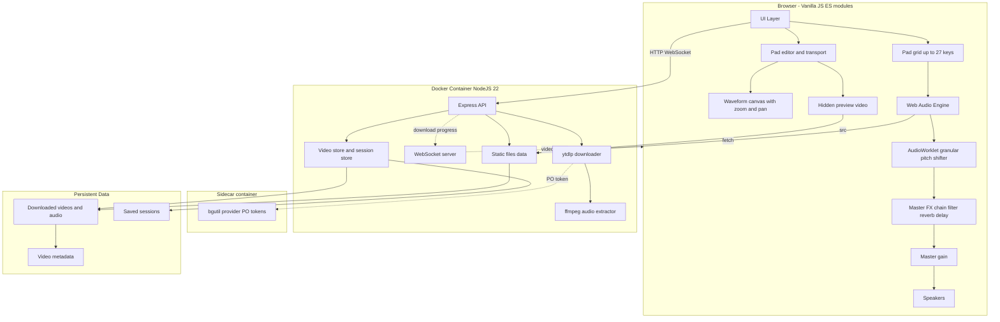

<div align="center">


# PumaSamplerMusic

**Turn YouTube videos into a keyboard sampler.** Download a video, pick any slice of time, and assign it to a key. Press the key — hear the audio and see the video play.

📖 [Leer en español](README.md)

[![Docker][docker-badge]][docker-link]
[![Node.js][node-badge]][node-link]
[![License][license-badge]](LICENSE)
[![PumaSoft][pumasoft-badge]][pumasoft-link]

[Download / Run](#quick-start) · [How it works](#how-it-works) · [Features](#features) · [Architecture](#architecture) · [Development](#development)

</div>

---

## Problem

Creating samplers from online videos is usually a multi-tool workflow: download with one app, cut with another, load into a DAW, map to MIDI. You just want a quick way to grab a kick from a drum video, a vocal stab from a live set, or a bass hit from a tutorial and play it from your keyboard.

PumaSamplerMusic solves that in one browser window: paste a YouTube URL, mark a slice, assign a key, play.

## Solution

- **Full video download** — `yt-dlp` downloads the complete video; `ffmpeg` extracts the audio track.
- **Up to 27 assignable pads** — each pad can bind to any keyboard key (or combination like `shift+a`).
- **Time-slice editor** — waveform display with drag handles, plus transport controls (play, mark in, mark out) to set the exact segment while the video is playing.
- **Session persistence** — save/load your pad layout as a JSON file, or start a new session from a template copied from an existing one.
- **Configurable pads** — 9 to 27 pads with per-pad color, volume, key, trigger mode, and loop; trigger by keyboard, mouse, or touch.
- **Master FX chain** — master volume, low-pass filter (cutoff/resonance), reverb, and delay (time/feedback) applied to everything that plays.
- **Per-pad FX** — Tune (±12 semitones), Cut, Res, Reverb send, and Delay send per pad, plus the P.SHIFT switch (tune shifts pitch without changing speed) and STRETCH with a Speed knob (50–200%, changes speed while keeping pitch); tweaking these while a pad loops warps it live.
- **Rotary knobs** — every master and per-pad FX control is a rotary knob (vertical drag, mouse wheel, Shift for fine adjustment), keyboard accessible.
- **Collapsible workspace** — the PADS, VIDEOS, pad editor, and General/Pad FX strip panels each collapse and are drag-resizable.
- **YouTube bot-check resiliency** — a sidecar container generates PO tokens so `yt-dlp` passes the "Sign in to confirm you're not a bot" check without cookies; if it still appears, paste a browser-exported cookies.txt as a fallback.
- **Runs in Docker** — single container, one port, no local Node.js or Python required.

## Quick Start

### Prerequisites

- [Docker](https://docs.docker.com/get-docker/) and Docker Compose v2
- Or, for bare-metal development: Node.js 22+, Python 3, yt-dlp, ffmpeg

### Option 1: manage.sh (recommended)

```bash
git clone https://github.com/felipesuarez-dev/PumaSamplerMusic.git
cd PumaSamplerMusic
./manage.sh start
```

### Option 2: Docker Compose

```bash
git clone https://github.com/felipesuarez-dev/PumaSamplerMusic.git
cd PumaSamplerMusic
docker compose up -d --build
```

Open http://localhost:4070

### Remote access (Tailscale)

If the server is on your tailnet, open `http://<server-hostname>:4070` from any device. With MagicDNS disabled, use the server's Tailscale IP, for example:

```
http://100.105.21.49:4070
```

No port forwarding is needed — Tailscale handles the encrypted tunnel.

### Keyboard shortcuts

| Key | Action |
|---|---|
| `I` | Set **In** point at the current preview position |
| `O` | Set **Out** point at the current preview position |
| `Space` | Play/pause preview |
| `Ctrl` + mouse wheel | Zoom the waveform in/out at the cursor position |
| `Escape` (configurable) | Stop all pads and pause the video |
| `Ctrl/Cmd + Shift + H` | Show/hide the top bar |

## How it works

1. **Add a video** — paste a YouTube URL in the **Video Library** tab and click **Add Video**.
2. **Wait for the download** — the backend downloads the full video and extracts the audio.
3. **Edit a pad** — click one of the pads. Pick the video, assign a key, and set the time segment. Tweak the per-pad FX knobs (Tune, Cut, Res, Rev, Dly, and the P.SHIFT/STRETCH switches with their Speed knob) to shape that pad's sound. Every change (start/end, color, volume, key, video, trigger mode, loop, FX) is auto-committed to the pad as you make it — there's no per-pad save button.
4. **Use the transport** — click **Play Preview** to watch the video, then **Set In** and **Set Out** to mark the slice. Or drag the waveform handles directly. Use `Ctrl` + mouse wheel to zoom into the waveform and drag to pan for precise slicing on long samples.
5. **Play** — press the assigned key. The audio plays through the Web Audio engine (through the master FX chain — filter, reverb, delay) and the video appears in the visualizer.
6. **Save your session** — give it a name and load it later. Starting a new session opens a template modal: start from a blank layout, or copy the pads from an existing session as a starting point.

## Features

| Area | What it does |
|---|---|
| **Video Library** | Add YouTube URLs, see download progress, remove cached videos, view title + duration |
| **Pad Grid** | Click, mouse, or touch to trigger and edit; pressing the assigned key also triggers; activity LED when a pad is playing |
| **Pad Editor** | Label, key, volume, color, trigger mode (one-shot / gate), loop, waveform segment editor; every edit auto-commits, no per-pad save button |
| **Per-pad FX** | Tune (±12 semitones), Cut, Res, Reverb send, and Delay send knobs per pad; P.SHIFT switch (tune shifts pitch without changing speed) and STRETCH switch with a Speed knob (50–200%, time-stretch); tweaking these live while a pad loops warps it in real time |
| **Rotary knobs** | Master and per-pad FX controls as rotary knobs: vertical drag, mouse wheel, Shift for fine adjustment, keyboard accessible |
| **Waveform Zoom/Pan** | `Ctrl` + mouse wheel to zoom, drag to pan, plus zoom in/out/reset buttons for precise slicing on long samples |
| **Transport** | Play preview, mark in, mark out, stop; playhead synced to the video position; Material Symbols icons instead of plain Unicode glyphs |
| **Session Manager** | Save/load/delete session JSON files; new-session modal to start fresh or copy pads from an existing session as a template |
| **Master FX** | Master volume, filter (cutoff/resonance), reverb, and delay (time/feedback) applied to everything that plays |
| **Collapsible workspace** | PADS, VIDEOS, pad editor, and General/Pad FX strip panels collapse from their header/tab and are drag-resizable |
| **Global Stop** | STOP button or **Escape** key silences all pads and pauses the video |
| **YouTube resiliency** | `bgutil-provider` container generates PO tokens to bypass YouTube's bot-check; cookies panel in Video Library as a fallback |
| **Docker** | One command to build, run, backup, and update |

## Architecture



Rule: the frontend only downloads audio buffers via HTTP; the backend handles all YouTube traffic, video download, and audio extraction. Sessions are plain JSON files.

## Tech Stack

| Frontend | Backend | DevOps |
|---|---|---|
| Vanilla JS ES modules | Node.js 22 | Docker + docker-compose |
| Web Audio API (filter, reverb, delay chain) + AudioWorklet (granular pitch-shifter) | Express | `manage.sh` wrapper |
| HTML5 `<video>` | `ws` library | HEALTHCHECK |
| Canvas waveform with zoom/pan | yt-dlp | bind-mount `./data` |
| CSS Grid + custom properties | ffmpeg | node user (uid 1000) |
| Material Symbols (Google Fonts) | | bgutil-ytdlp-pot-provider (sidecar) |

## Development

```bash
# Start container in background
./manage.sh start

# View logs
./manage.sh logs

# Stop
./manage.sh stop

# Rebuild image
./manage.sh update

# Backup data + config
./manage.sh backup
```

## Configuration

Edit `docker-compose.yml`:

| Variable | Default | Meaning |
|---|---|---|
| `MAX_CACHE_GB` | 10 | Max disk space for cached videos |
| `MAX_CONCURRENT_DOWNLOADS` | 2 | Parallel downloads |
| `TZ` | America/Santiago | Timezone |
| `PORT` | 4070 | Internal + external port |
| `COOKIES_FILE` | `/data/cookies.txt` | Path to cookies file for yt-dlp |
| `POT_PROVIDER_URL` | `http://bgutil-provider:4416` | PO token provider URL |

## Data Layout

```
./data/videos/   — downloaded videos (.mp4), extracted audio (.opus), and video metadata JSON files
./data/sessions/ — saved session JSON files
```

## Notes

- Only YouTube URLs are accepted (`youtube.com/watch?v=...` and `youtu.be/...`).
- First playback of a video may have a short load time while the browser decodes the audio buffer.
- One-shot mode plays the full segment on key press; gate mode plays while the key is held.
- The video cache uses disk, not RAM, because full 1080p videos exceed practical tmpfs limits.
- If YouTube shows the bot-check error despite the PO-token provider, paste a browser-exported cookies.txt into the YouTube cookies panel in the Video Library.

## Author

<div align="center">


**[PumaSoft][pumasoft-link]**

</div>

## License

MIT © 2026 PumaSoft — see [LICENSE](LICENSE).

[docker-badge]: https://img.shields.io/badge/Docker-2496ED?style=flat-square&logo=docker&logoColor=white
[docker-link]: https://www.docker.com
[node-badge]: https://img.shields.io/badge/Node.js-22-339933?style=flat-square&logo=node.js&logoColor=white
[node-link]: https://nodejs.org
[license-badge]: https://img.shields.io/badge/license-MIT-a8d8a8?style=flat-square
[pumasoft-badge]: https://img.shields.io/badge/by-PumaSoft-ff9f1c?style=flat-square
[pumasoft-link]: https://github.com/felipesuarez-dev
