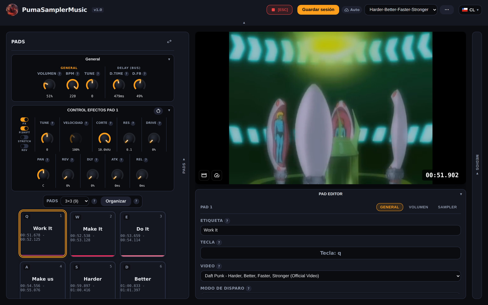
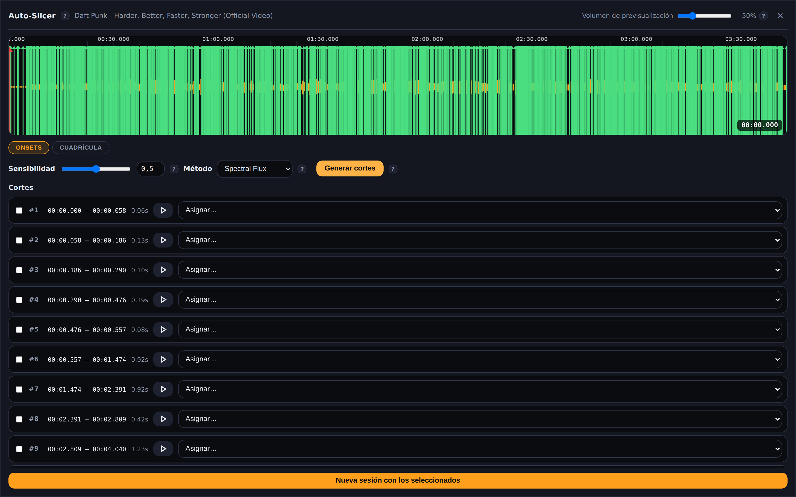
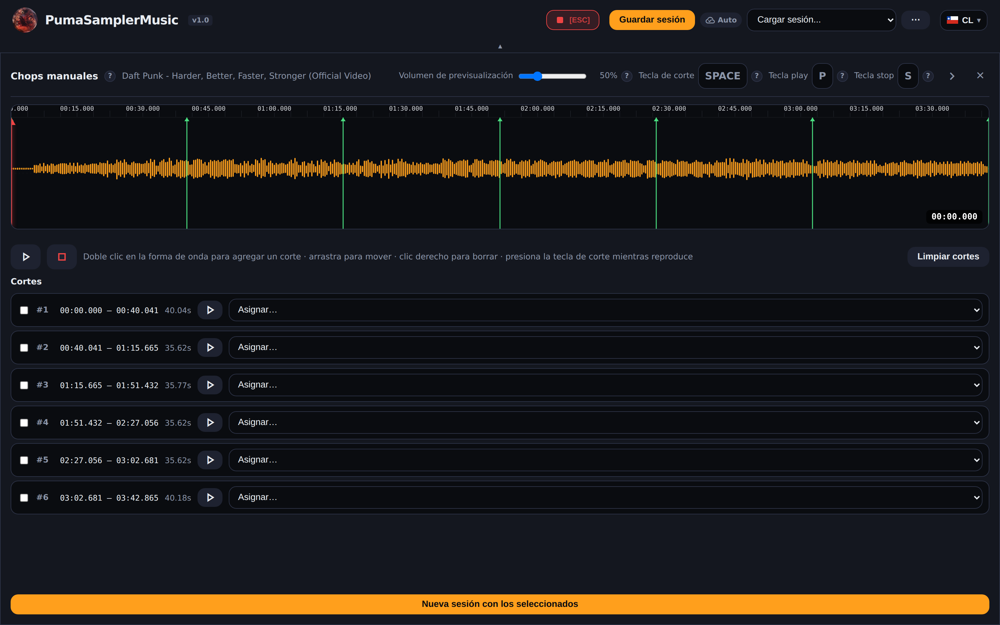
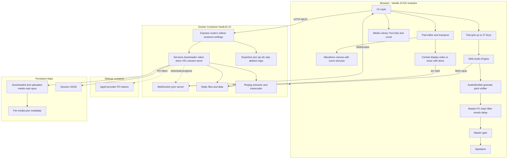

<div align="center">


# PumaSamplerMusic

**Turn YouTube videos or local files into a keyboard sampler.** Download a video (or upload your own audio/video), pick any slice of time, and assign it to a key. Press the key — hear the audio and see the video play.

📖 [Leer en español](README.md)

[![Docker][docker-badge]][docker-link]
[![Node.js][node-badge]][node-link]
[![License][license-badge]](LICENSE)
[![PumaSoft][pumasoft-badge]][pumasoft-link]

[Download / Run](#download--run) · [How it works](#how-it-works) · [Features](#features) · [Architecture](#architecture) · [Development](#development)



</div>

---

## Problem

Creating samplers from online videos is usually a multi-tool workflow: download with one app, cut with another, load into a DAW, map to MIDI. You just want a quick way to grab a kick from a drum video, a vocal stab from a live set, or a bass hit from a tutorial and play it from your keyboard.

PumaSamplerMusic solves that in one browser window: paste a YouTube URL (or upload a local file), mark a slice, assign a key, play.

## Solution

- **Full video download** — `yt-dlp` downloads the complete video; `ffmpeg` extracts the audio track.
- **Local media** — beyond YouTube, you can upload your own audio or video files from the **Local** tab of the Media Library; they're processed with `ffmpeg` just like downloaded ones.
- **Up to 27 assignable pads** — each pad can bind to any keyboard key (or combination like `shift+a`).
- **Time-slice editor** — waveform display with drag handles, plus transport controls (play, mark in, mark out) to set the exact segment while the media plays.
- **Auto-Slicer** — analyzes a media's audio (spectral-flux onset detection, or a beat grid) and generates slices automatically; review them on the waveform, preview each one, and assign them to free pads or create a new session from the selection.
- **Manual chops** — cut the track by hand by placing each mark on the waveform, with the same preview and assignment options.
- **Session persistence** — save or load your pad layout as a JSON file, or start a new session from a template copied from an existing one. The session manager adds search and per-session delete.
- **DAW export** — export the session as a `.zip` package (`.opus` + `.wav` audio + manifest), as a re-importable `.pss`, or to instrument formats: **SFZ, DecentSampler, MPC (.xpm), FL Slicer, Ableton, and Logic**.
- **Organize mode** — rearrange the grid without triggering audio: drag to swap or move pads, copy one pad to another, or clear it with a confirmation modal; a context menu (right-click / long-press) offers the same.
- **Compact header** — secondary actions (New, Manage, Export, Import, Logs, Settings) live in a three-dots (⋯) menu; each of the five actions can be pinned to the toolbar as a button. The STOP button shows only its icon and the configured key.
- **Flexible workspace** — the MEDIA and PADS panels can swap sides, and a single control collapses or expands every menu at once.
- **Settings** — a modal with the configurable stop key, the slicer keys, and the app text size; preferences persist across sessions.
- **Configurable pads** — 9 to 27 pads with per-pad color, volume, key, trigger mode, and loop; trigger by keyboard, mouse, or touch.
- **Master FX chain** — master volume, low-pass filter (cutoff/resonance), reverb, and delay (time/feedback) applied to everything that plays.
- **Per-pad FX** — Tune (±12 semitones), Cut, Res, Reverb send, and Delay send per pad, plus the P.SHIFT switch (tune shifts pitch without changing speed) and STRETCH with a Speed knob (50–200%, changes speed while keeping pitch); tweaking these while a pad loops warps it live.
- **Visualizer skins** — the central display switches between video, waveform, spectrum bars, bubbles, and an animated vinyl turntable that spins with the audio.
- **Rotary knobs** — every master and per-pad FX control is a rotary knob (vertical drag, mouse wheel, Shift for fine adjustment), keyboard accessible.
- **YouTube bot-check resiliency** — a sidecar container generates PO tokens so `yt-dlp` passes the "Sign in to confirm you're not a bot" check without cookies; if it still appears, you can load a browser-exported `cookies.txt` from Settings.
- **Runs in Docker** — single container, one port, no local Node.js or Python required.

## Download / Run

The recommended way is Docker: one container, one port, no local Node.js or Python. If you'd rather run it straight on your system, the bare-metal option is below.

### Option 1: manage.sh (recommended)

Requires [Docker](https://docs.docker.com/get-docker/) and Docker Compose v2. The `manage.sh` wrapper builds the image, brings up the container and the PO-token sidecar, and exposes logs, backup, and update commands.

```bash
git clone https://github.com/felipesuarez-dev/PumaSamplerMusic.git
cd PumaSamplerMusic
./manage.sh start
```

Available commands: `start`, `stop`, `restart`, `status` (state + health), `logs`, `backup`, `update` (rebuilds without cache), `clean` (removes dangling images), and `info`.

### Option 2: Docker Compose

Same requirements, without the wrapper:

```bash
git clone https://github.com/felipesuarez-dev/PumaSamplerMusic.git
cd PumaSamplerMusic
docker compose up -d --build
```

### Option 3: bare-metal (no containers)

For development, or if you'd rather not use Docker. You need **Node.js ≥ 22** and, on your `PATH`, **`python3`**, **`yt-dlp`**, and **`ffmpeg`** (the backend uses them to download and process audio).

```bash
git clone https://github.com/felipesuarez-dev/PumaSamplerMusic.git
cd PumaSamplerMusic
npm ci
npm start          # node src/server.js — listens on 0.0.0.0:4070
```

- `npm run dev` — same, but with auto-reload (`node --watch`).
- `npm test` — runs the test suite (`node --test`, Node's built-in runner).
- Data is stored under `DATA_DIR` (defaults to `/data`), holding `videos/` and `sessions/`. For bare-metal, point it at a local folder, e.g. `DATA_DIR=./data npm start`. Both folders are created on first run.

With any of the three options, open **http://localhost:4070**. Service state is available at `GET /api/health`.

#### Reaching it from another machine: you need HTTPS or localhost

Two features use **AudioWorklet**: the turntable scratch and P.SHIFT (retuning without changing speed). Browsers only expose that API in a [secure context](https://developer.mozilla.org/en-US/docs/Web/Security/Secure_Contexts) — **HTTPS** or **`localhost`**.

Opening the app over `http://` at an **IP address** (say `http://192.168.1.50:4070`) puts it outside a secure context: the scratch reports that it needs a secure page, and P.SHIFT silently falls back to a speed change that drags pitch along with it. Everything else works normally.

If you serve the app from another box, the simplest fix is an SSH tunnel, which turns the access into `localhost`:

```bash
ssh -L 4070:localhost:4070 user@server
# then open http://localhost:4070 in your browser
```

For something permanent, put HTTPS in front of it with a reverse proxy and a domain name (Caddy, nginx + Let's Encrypt, Cloudflare Tunnel, or `tailscale serve` if you use Tailscale with HTTPS certificates enabled on the tailnet). Two details that save time:

- A valid certificate needs a **DNS name**: no public CA issues certificates for private IP addresses, so `https://192.168.x.x` is not an option.
- The port does not matter. What makes a context secure is the `https://` scheme plus a valid certificate, so if 443 is already taken by another service, any other port works just as well (`https://host:8443`).

### Keyboard shortcuts

The stop key and the slicer (Auto-Slicer / Chops) keys are **configurable** from **Settings**; the defaults are listed below. Global shortcuts stand down while you're typing in a text field.

**Global / Top bar**

| Key | Action |
|---|---|
| `Escape` (configurable) | Stop all pads and pause the video |
| `Ctrl/Cmd + Shift + H` | Show or hide the top bar |

**Pads**

| Key | Action |
|---|---|
| Key or combo assigned to the pad | Triggers the pad on press and releases it on release; set in the Pad Editor and supports combos like `shift+a` |

**Pad Editor** (with a pad selected)

| Key | Action |
|---|---|
| `I` | Set the **In** point at the playhead position |
| `O` | Set the **Out** point at the playhead position |
| `Space` | Play or pause the pad preview |
| `Escape` | Cancel a pad drag in progress (Organize mode) |

**Auto-Slicer**

| Key (default) | Action |
|---|---|
| `Space` (cut) | Place a cut at the playhead position |
| `Ctrl/Cmd + Z` | Undo the last cut or edit |

**Manual chops**

| Key (default) | Action |
|---|---|
| `Space` (cut) | Place a cut at the playhead position |
| `P` (play) | Play or pause the full track |
| `S` (stop) | Stop the full track |
| `Ctrl/Cmd + Z` | Undo the last cut or edit |

**Waveform (editor and slicer)**

| Key | Action |
|---|---|
| `Ctrl/Cmd + mouse wheel` | Zoom in/out at the cursor position |
| Drag | Pan the waveform when zoomed |

> `Space` is contextual: in the pad editor it plays/pauses the preview; inside the slicer it places a cut (the slicer captures the key before the editor does).

## How it works

1. **Add media** — paste a YouTube URL in the **YouTube** tab of the Media Library and click **Add Video**; or upload an audio or video file from the **Local** tab.
2. **Wait for processing** — the backend downloads the full video (or processes your file) and extracts the audio.
3. **Edit a pad** — click one of the pads. Pick the media, assign a key, and set the time segment. Tweak the per-pad FX knobs (Tune, Cut, Res, Rev, Dly, and the P.SHIFT/STRETCH switches with their Speed knob) to shape that pad's sound. Every change (start/end, color, volume, key, media, trigger mode, loop, FX) is auto-committed to the pad as you make it — there's no per-pad save button.
4. **Use the transport** — click **Play Preview** to watch the media, then **Set In** and **Set Out** to mark the slice. Or drag the waveform handles directly. Use `Ctrl` + mouse wheel to zoom into the waveform and drag to pan for precise slicing on long samples.
5. **Play** — press the assigned key. The audio plays through the Web Audio engine (through the master FX chain — filter, reverb, delay) and the video appears in the visualizer.
6. **Save your session** — the **Save** button opens a modal to name it; load it later from the selector or the **Manage** modal (with search and per-session delete). Starting a new session opens a template modal: start from a blank layout, or copy the pads from an existing session as a starting point.
7. **Organize the grid** — toggle **Organize** (next to the PADS selector) to drag and swap/move pads, copy one to another, or clear it; pads don't trigger audio while it's active.

### Turntable scratch

On the **vinyl** skin, switch on **DJ mode** with the hand button (next to the spin-speed control). It is off by default, because the engine keeps a full copy of the track's samples and a stray drag on the record would interrupt playback.

With it on, move the cursor onto the record and it becomes a hand. Press and drag to scratch the track like a turntable — forward, backward, and at any speed in between, calibrated to 33⅓ RPM (one hand-turn every ~1.8s is normal speed). Let go and it coasts back to normal speed if the track was playing, or down to a stop if it was paused.

Pads **keep playing** while you scratch: you scratch over the loop, the way a DJ does. Only the centre track stops.

Needs a secure page (see [Reaching it from another machine](#reaching-it-from-another-machine-you-need-https-or-localhost)).

### Auto-Slicer

Analyzes a full track (spectral-flux onset detection or a beat grid), lets you preview each cut, and assigns them to pads or spins up a new session from the selected ones.



### Manual chops

Chop the track by hand: double-click the waveform to drop each cut, preview them, and assign them to pads or start a new session from the selected ones.

In both modes, the **half-width** button in the panel header pulls it back to the edge of the pads, leaving them visible and usable at the same time — and collapsing the pads hands the freed space to the panel. From there you can **drag a slice** by its grip and drop it on any pad, with a translucent thumbnail of that slice's waveform following the cursor. The assignment combobox still works; both paths share the same logic, including the confirm prompt when a pad is already taken. Each slice also gets its own delete button, and **Clear cuts** asks before discarding them all.



## Features

| Area | What it does |
|---|---|
| **Media Library** | **YouTube** tab: add URLs, see download progress, remove cached media, view title and duration. **Local** tab: upload audio or video files, search, and manage them |
| **Pad Grid** | Click, mouse, or touch to trigger and edit; pressing the assigned key also triggers; activity LED when a pad is playing |
| **Organize Mode** | Button next to the PADS selector: drag to swap or move, context menu (right-click / long-press), copy to another pad, clear with confirmation; doesn't trigger audio while active |
| **Pad Editor** | Label, key, volume, color, trigger mode (one-shot / gate), loop, waveform segment editor; every edit auto-commits, no per-pad save button |
| **Per-pad FX** | Tune (±12 semitones), Cut, Res, Reverb send, and Delay send knobs per pad; P.SHIFT switch (tune shifts pitch without changing speed) and STRETCH switch with a Speed knob (50–200%, time-stretch); tweaking these live while a pad loops warps it in real time |
| **Rotary knobs** | Master and per-pad FX controls as rotary knobs: vertical drag, mouse wheel, Shift for fine adjustment, keyboard accessible |
| **Auto-Slicer / Manual chops** | Automatic cut detection (adjustable sensitivity, real progress bar) or hand-placed cuts on the waveform; slice list with durations, preview, per-slice delete, and selective assignment bounded by the pads in the grid |
| **Slices to pads** | Half-width mode parks the panel beside the pads (and grows when you collapse them); drag a slice by its grip onto a pad, with a translucent thumbnail of its waveform tracking the cursor; the assignment combobox stays available and shares the same confirm logic |
| **Turntable scratch** | On the vinyl skin, grab the record with the mouse to scratch the track forward and backward at any speed (AudioWorklet engine, calibrated to 33⅓ RPM); release to coast back to speed or to a stop, and pads keep playing while you scratch. Needs a secure page (HTTPS or localhost) |
| **Waveform Zoom/Pan** | `Ctrl` + mouse wheel to zoom, drag to pan, plus zoom in/out/reset buttons for precise slicing on long samples |
| **Transport** | Play preview, mark in, mark out, stop; playhead synced to the video position; Material Symbols icons |
| **Session Manager** | Save (name modal), load, or delete sessions; Manage modal with search and per-row delete; new-session modal to start fresh or copy pads from an existing session as a template |
| **Export** | `.zip` package (opus + WAV + manifest) or re-importable `.pss`; exporters to SFZ, DecentSampler, MPC (.xpm), FL Slicer, Ableton, and Logic |
| **Visualizer skins** | Central display switchable between video, waveform, spectrum bars, bubbles, and an animated vinyl turntable |
| **Compact header / ⋯ menu** | Secondary actions in a three-dots menu; each can be pinned to the toolbar as a button (remembered); STOP shows only icon + key |
| **Settings** | Modal with configurable stop key, slicer keys, and app text size; preferences persist |
| **Master FX** | Master volume, filter (cutoff/resonance), reverb, and delay (time/feedback) applied to everything that plays |
| **Collapsible workspace** | MEDIA, PADS, pad editor, and General/Pad FX strip panels collapse and are drag-resizable; MEDIA and PADS can swap sides and a single control collapses/expands everything |
| **Global Stop** | STOP button or **Escape** key silences all pads and pauses the video |
| **YouTube resiliency** | The `bgutil-provider` container generates PO tokens to bypass YouTube's bot-check; as a fallback, you can load a `cookies.txt` from Settings |
| **Docker** | One command to build, run, backup, and update |

## Architecture


```mermaid
flowchart TD
    subgraph Browser["Browser - Vanilla JS ES modules"]
        UI[UI Layer] --> Pads[Pad grid up to 27 keys]
        UI --> Editor[Pad editor and transport]
        UI --> Library[Media Library YouTube and Local]
        Pads --> AudioEngine[Web Audio Engine]
        Editor --> Waveform[Waveform canvas with zoom and pan]
        Editor --> MediaDisplay[Central display video or wave with skins]
        AudioEngine --> PitchShifter[AudioWorklet granular pitch shifter]
        PitchShifter --> MasterFX[Master FX chain filter reverb delay]
        MasterFX --> MainGain[Master gain]
        MainGain --> Speakers[Speakers]
    end

    UI -->|HTTP REST| API
    UI <-->|WebSocket| WS
    AudioEngine -->|fetch opus| StaticFiles
    MediaDisplay -->|src mp4| StaticFiles

    subgraph Docker["Docker Container NodeJS 22"]
        API[Express routers videos sessions settings]
        WS[WebSocket sync server]
        Services[Services downloader video-store LRU session-store]
        Exporters[Exporters pss zip sfz mpc ableton logic]
        Ffmpeg[ffmpeg extractor and transcoder]
        StaticFiles[Static files and data]
        API --> Services
        API --> Exporters
        Services --> Ffmpeg
        Services --> StaticFiles
    end

    subgraph BotCheck["Sidecar container"]
        PotProvider[bgutil provider PO tokens]
    end

    Services -.->|PO token| PotProvider

    subgraph Data["Persistent Data"]
        Videos[Downloaded and uploaded media mp4 opus]
        Sessions[Session JSON]
        Metadata[Per-media json metadata]
    end

    Services --> Videos
    Services --> Sessions
    Videos --> Metadata

    Services -.->|download progress| WS
    WS -.->|media ready| Browser
```

Rule: the frontend only downloads audio buffers via HTTP; the backend handles all YouTube traffic, video download, and audio processing with `ffmpeg`. Real-time sync (pad triggers, download progress) travels over WebSocket. Sessions are plain JSON files.

## Tech Stack

| Frontend | Backend | DevOps |
|---|---|---|
| Vanilla JS ES modules (no bundler) | Node.js ≥ 22 (ES modules) | Docker + docker-compose |
| Web Audio API (filter, reverb, delay) + AudioWorklet (granular pitch-shifter) | Express (`videos`/`sessions`/`settings` routers) | `manage.sh` wrapper |
| HTML5 `<video>` + canvas skins | `ws` (real-time sync) | HEALTHCHECK (`/api/health`) |
| Canvas waveform with zoom/pan | `busboy` (uploads), `archiver` (ZIP export) | bind-mount `./data` and `./src` |
| CSS (5 domain files) + Material Symbols | `yt-dlp` + `ffmpeg` | node user (uid 1000) |
| Tests with `node --test` | `bgutil-ytdlp-pot-provider` (sidecar) | self-updating yt-dlp channel |

## Development

Project layout:

```
src/
  server.js              # Express + WebSocket bootstrap
  routes/                # videos, sessions, settings (+ health, logs)
  services/              # downloader, video-store (LRU cache), session-store,
                         # local-media, exporters/ (DAW), ytdlp-updater
  utils/                 # config, logger, validation
  public/
    index.html
    js/                  # frontend ES modules (app, audio-engine, pads,
                         # waveform, slicer, media-display, session, i18n…)
    css/                 # 01..05, one file per domain
```

Workflow:

```bash
npm start        # node src/server.js
npm run dev      # node --watch (auto-reload)
npm test         # node --test (built-in runner, no extra dependencies)
```

With Docker, `docker-compose.yml` mounts `./src:/app/src`, so frontend changes show up without rebuilding the image (just reload the browser). The `manage.sh` wrapper covers the rest:

```bash
./manage.sh start     # build and start in the background
./manage.sh logs      # follow the logs
./manage.sh status    # container state + health
./manage.sh stop      # stop and take the containers down
./manage.sh update    # rebuild the image without cache and relaunch
./manage.sh backup    # back up config + data into a .tar.gz
```

## Configuration

Edit `docker-compose.yml`. The column shows the compose values; some differ from the code default (shown in parentheses).

| Variable | In `docker-compose.yml` | Meaning |
|---|---|---|
| `PORT` | 4070 | Internal and external port |
| `HOST` | `0.0.0.0` | Listen address |
| `DATA_DIR` | `/data` | Data folder (`videos/` + `sessions/`) |
| `MAX_CACHE_GB` | 5 (code: 10) | Max disk space for cached media (LRU eviction) |
| `MAX_CONCURRENT_DOWNLOADS` | 1 (code: 2) | Parallel YouTube downloads (1 is temporary due to a 429 throttle) |
| `MAX_CONCURRENT_UPLOADS` | 2 | Parallel local-file uploads |
| `MAX_UPLOAD_MB` | 4096 | Max size per uploaded file, in MB |
| `POT_PROVIDER_URL` | `http://bgutil-provider:4416` | PO token provider URL |
| `COOKIES_FILE` | `/data/cookies.txt` | Path to a `cookies.txt` for `yt-dlp` (optional) |
| `YTDLP_CHANNEL` | `stable` | yt-dlp self-update channel (`stable` / `nightly`) |
| `NODE_ENV` | `production` | Runtime environment |
| `TZ` | America/Santiago | Timezone |

Cookies are optional: they're only used if `COOKIES_FILE` points to an existing file. You can load a browser-exported `cookies.txt` from **Settings** (or drop the file at that path). The PO-token provider (`bgutil-provider`) is usually enough to pass the bot-check without cookies.

## Data Layout

```
data/
  videos/    <id>.mp4    — downloaded or uploaded video
             <id>.opus   — extracted audio (opus 160k)
             <id>.json   — metadata: title, duration, source (youtube/local), kind (video/audio)
  sessions/  <name>.json — saved session
```

- Each media item is identified by an 11-character id (local ones get a generated id in the same format).
- The cache applies **LRU** eviction by last-use date (`updatedAt`) when it exceeds `MAX_CACHE_GB`. **Local media is never auto-evicted**: only re-downloadable YouTube content is reclaimed.
- A session is a JSON file with `schemaVersion`, `masterFx` (volume, cutoff, resonance, reverb, delay, bpm, tune), and `pads[]` (position, key, `videoId`, `start`/`end`, plus FX and UI fields like label, color, volume, trigger mode, and loop).
- Export bundles are generated on demand; they aren't stored in `data/`. There's no default `cookies.txt` either — it's created only if you configure one.

## Notes

- Beyond YouTube URLs (`youtube.com/watch?v=...` and `youtu.be/...`), you can upload local audio or video files from the **Local** tab.
- First playback of a media item may have a short load time while the browser decodes the audio buffer. These are two different transfers: the Library download goes from YouTube to the server, while the editor's goes from the server to the browser (plus decoding). The editor's captions name them separately, an already-decoded track opens instantly, and hovering the scissors prefetches it.
- The decoded-audio cache lives in memory, so it empties on a page reload.
- The turntable scratch and P.SHIFT need **AudioWorklet**, which browsers only expose on secure pages (HTTPS or `localhost`). See [Reaching it from another machine](#reaching-it-from-another-machine-you-need-https-or-localhost).
- One-shot mode plays the full segment on key press; gate mode plays while the key is held.
- The media cache uses disk, not RAM, because full 1080p videos exceed practical tmpfs limits.
- If YouTube shows the bot-check error despite the PO-token provider, load a browser-exported `cookies.txt` from **Settings** (or via `COOKIES_FILE`).

## Author

<div align="center">


**[PumaSoft][pumasoft-link]**

</div>

## Acknowledgments

The Auto-Slicer and the per-pad envelope FX draw on concepts from these open-source projects (concepts and design parameters only; no code was copied):

- **[Ninjas 2](https://github.com/clearly-broken-software/ninjas2)** (GPL-3.0) — the slice-sensitivity concept (a single control inversely mapped to the detection threshold) and the slicer UX.
- **[Shuriken Beat Slicer](https://github.com/rock-hopper/shuriken)** (GPL-2.0) — the onset-detection parameters (window/hop size, minimum inter-onset interval) and snapping cuts to the nearest zero crossing.
- **[Grace](https://github.com/s-oram/Grace)** (MIT) — the envelope and region concepts applied to the per-pad controls.

## License

MIT © 2026 PumaSoft — see [LICENSE](LICENSE).

[docker-badge]: https://img.shields.io/badge/Docker-2496ED?style=flat-square&logo=docker&logoColor=white
[docker-link]: https://www.docker.com
[node-badge]: https://img.shields.io/badge/Node.js-22-339933?style=flat-square&logo=node.js&logoColor=white
[node-link]: https://nodejs.org
[license-badge]: https://img.shields.io/badge/license-MIT-a8d8a8?style=flat-square
[pumasoft-badge]: https://img.shields.io/badge/by-PumaSoft-ff9f1c?style=flat-square
[pumasoft-link]: https://github.com/felipesuarez-dev
